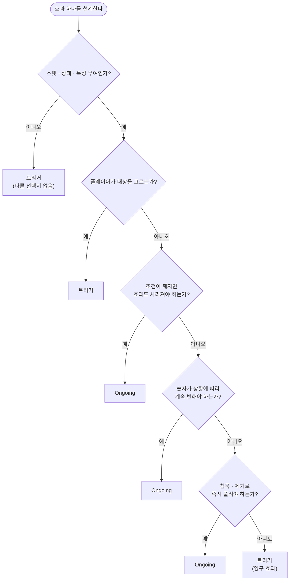

# 트리거 효과 vs Ongoing 효과

최종 갱신: 2026-08-04

카드 효과를 만들 때 **트리거로 할지 Ongoing으로 할지** 고르는 기준을 정리한 문서다.
효과가 발동하는 순서와 사망 처리 타이밍은 [`effect-resolution-flow.md`](effect-resolution-flow.md)에 있다.

---

## 한 줄 요약

> **트리거는 "그 순간 한 번 일어나는 일"이고, Ongoing은 "조건이 맞는 동안 유지되는 상태"다.**
> 트리거는 실행하고 끝나면 결과가 남는다. Ongoing은 실행이 아니라 **매번 다시 계산**되므로
> 조건이 깨지면 저절로 사라진다.

---

## 1. 차이점

| | 트리거 효과 | Ongoing 효과 |
|---|---|---|
| **발동 시점** | 이벤트가 일어난 그 순간 **한 번** | 조건이 맞는 **동안 계속** |
| **처리 방식** | Resolve 큐에 적재 → 순서대로 실행 | 큐를 타지 않음. 전부 지우고 **재계산** |
| **결과의 지속** | 영구히 남는다 | 조건이 깨지면 **자동으로 사라진다** |
| **침묵당하면** | 이미 발동한 결과는 그대로 | **즉시 사라진다** |
| **제공자가 죽으면** | 이미 발동한 결과는 그대로 | **즉시 사라진다** |
| **쓸 수 있는 효과** | 전부 (49종) | **스탯·상태·특성 부여만 (9종 + 상태)** |
| **플레이어 대상 선택** | 가능 | **불가능** |
| **필터 / 정렬** | 가능 | **무시됨** |
| **발동 순서** | play order · 연쇄 우선 등 규칙 있음 | **순서 개념이 없음** |

### "실행"이 아니라 "재계산"이다

Ongoing을 이해하는 열쇠다.

```
트리거 :  이벤트 → 큐에 적재 → 실행 → 결과가 보드에 남는다

Ongoing:  (큐 없음)
          보드가 바뀔 때마다
            ① 모든 카드의 Ongoing 수치를 전부 지운다
            ② 조건이 맞는 것만 처음부터 다시 계산한다
```

그래서 Ongoing은 **몇 번을 다시 계산해도 결과가 같다**. 순서를 따질 이유도, 중복 적용될
걱정도 없다. 대신 조건이 거짓이 되는 순간 계산에서 빠지므로 효과도 함께 없어진다.

재계산은 **보드가 바뀌는 거의 모든 지점**에서 일어난다 — 턴 시작, 카드 플레이, 이동,
공격 전후, 클럽 추가, 사망 처리 앞뒤, 어빌리티 처리 후 등.

### Ongoing으로 만들 수 있는 효과

전체 49종 중 **9종**만 Ongoing을 지원한다. 그리고 어빌리티의 **상태(Status) 부여**는
Ongoing에서도 동작한다.

| 분류 | 효과 |
|---|---|
| 스탯 | `EffectAddStat` · `EffectSetStat` · `EffectSetStatCustom` |
| 개수 비례 스탯 | `EffectAddStatCount` · `EffectAddStatTotalCount` |
| 부여 | `EffectAddAbility` · `EffectAddTrait` · `EffectAddClub` |
| UI | `EffectSetClubCardUI` |
| (상태) | 어빌리티의 `status` 목록 — 버프/디버프 부여 |

**피해 · 회복 · 드로우 · 소환 · 파괴 · 이동은 Ongoing으로 만들 수 없다.**
재계산할 때마다 반복 적용되어 버리므로 구조상 불가능하다.

> ⚠️ 지원하지 않는 효과를 Ongoing으로 지정하면 **오류 없이 조용히 아무 일도 일어나지 않는다.**
> 카드가 안 먹는다는 제보가 오면 여기부터 확인할 것.

### 조건이 매번 다시 검사된다

Ongoing은 재계산할 때마다 발동 조건과 대상 조건을 **처음부터 다시** 검사한다.

| 상황 | 트리거 | Ongoing |
|---|---|---|
| "아군 3명 이상일 때 +1/+1" → 아군이 2명이 됨 | 버프 유지 | **버프 사라짐** |
| 제공자가 침묵당함 | 이미 준 버프 유지 | **즉시 사라짐** |
| 제공자가 죽음 | 이미 준 버프 유지 | **즉시 사라짐** |
| 대상이 조건을 벗어남 | 유지 | **사라짐** |

### 체력이 줄어드는 경우

Ongoing 버프가 빠져 **최대 체력이 줄어도 현재 체력은 유지되고 상한만 걸린다.**
버프가 빠졌다는 이유만으로 죽지 않는다.

단 **최대 체력 자체가 0 이하**가 되면 다음 사망 처리에서 죽는다.
(오라 제공자가 죽어 연쇄로 죽는 경우)

---

## 2. 판단 기준

### Ongoing을 써야 하는 경우

**① 조건이 깨지면 효과도 사라져야 할 때**

- "아군 유닛이 3명 이상이면 +2/+2"
- "체력이 절반 이하일 때 공격력 +3"
- "이 카드가 필드에 있는 동안 아군 전체 +1/+1"

조건과 효과가 **한 몸**인 경우다. 조건이 트리거에서는 **입장권**(한 번 통과하면 끝)이지만,
Ongoing에서는 **버팀목**(계속 참이어야 효과가 서 있음)이다.

같은 카드를 둘로 만들면 이렇게 갈린다 — 「아군이 3명 이상이면 +2/+2」, 기본 스탯 2/2:

| 시점 | 상황 | Ongoing | 트리거 |
|---|---|---|---|
| t1 | 아군 3명 | 4/4 | 4/4 |
| t2 | 하나 죽어서 2명 | **2/2로 복귀** | 4/4 유지 |
| t3 | 다시 소환해서 3명 | **4/4** | **6/6** ← 또 쌓임 |
| t4 | 이 카드가 침묵당함 | **2/2** | 6/6 유지 |

"한 몸"의 결과가 둘로 나타난다:
**(1) 조건이 깨지면 효과도 사라진다**(t2), **(2) 조건이 여러 번 만족돼도 중복되지 않는다**(t3).
트리거는 조건을 만족할 때마다 또 쌓인다 — 그게 의도면 트리거, 아니면 Ongoing이다.

**② 침묵·제거로 즉시 풀려야 할 때**

"이 유닛이 주는 버프"는 대부분 여기 해당한다. 제공자를 없애면 버프도 없어지는 게
플레이어의 직관과 맞는다.

**③ 숫자가 계속 변해야 할 때**

- "아군 수만큼 공격력 증가"
- "손패 장수만큼 체력 증가"

Ongoing이면 아군이 늘고 줄 때마다 자동으로 따라간다. 트리거로 만들면 발동한 순간의
숫자로 고정된다.

**④ 계산 결과가 항상 같아야 할 때**

Ongoing은 순서 개념이 없어 **중복 적용이나 순서 꼬임이 원천적으로 없다.**
버프 카드가 여럿 겹쳐도 결과가 안정적이다.

### 트리거를 써야 하는 경우

**① 스탯·상태 부여가 아닌 모든 것**

피해 · 회복 · 드로우 · 소환 · 파괴 · 이동 · 카드 생성 — **선택의 여지가 없다.**

**② 결과가 영구히 남아야 할 때**

- "전투의 함성: 아군 하나에게 +2/+2" ← 준 뒤에는 이 카드가 죽어도 남아야 한다

같은 "+2/+2"라도 **영구 버프면 트리거, 유지형 버프면 Ongoing**이다. 이게 가장 자주
헷갈리는 지점.

**③ 플레이어가 대상을 고를 때**

Ongoing은 대상 선택을 지원하지 않는다.

**④ "~할 때마다" 같이 횟수가 의미 있을 때**

- "적이 죽을 때마다 +1/+1" ← 누적되어야 하므로 트리거

**⑤ 필터·정렬로 대상을 추려야 할 때**

Ongoing은 필터/정렬을 무시한다.

### 같은 문구, 다른 선택

| 카드 텍스트 | 선택 | 이유 |
|---|---|---|
| "아군 전체 +1/+1" (지속) | **Ongoing** | 이 카드가 사라지면 버프도 빠져야 함 |
| "전투의 함성: 아군 전체 +1/+1" | **트리거** | 준 뒤에는 독립적으로 남아야 함 |
| "아군 수만큼 공격력 증가" | **Ongoing** | 숫자가 계속 변함 |
| "적이 죽을 때마다 공격력 +1" | **트리거** | 누적되어야 함 |
| "체력이 3 이하면 공격력 2배" | **Ongoing** | 조건이 풀리면 되돌아가야 함 |
| "체력이 3 이하가 되면 카드를 뽑는다" | **트리거** | 드로우는 Ongoing 불가 |

### 텍스트로 구분하는 요령

| 서술 | 성격 | 선택 |
|---|---|---|
| "~인 **동안**", "~**이면**" | 상태 서술 | Ongoing |
| "~**하면**", "~할 **때마다**", "~하고 나면" | 사건 서술 | 트리거 |

"이면 / 하면"은 한국어로 헷갈리기 쉽다. 애매하면 **"조건이 풀렸을 때 되돌아가야 하나?"**를
물어보면 갈린다 — 되돌아가야 하면 Ongoing이다.

---

## 3. 결정 순서도



---

## 4. 흔한 실수

| 실수 | 증상 |
|---|---|
| 피해 · 드로우 · 소환을 Ongoing으로 지정 | **오류 없이 아무 일도 안 일어남** |
| 영구 버프를 Ongoing으로 지정 | 제공자가 죽거나 침묵당하면 버프가 사라짐 |
| 유지형 버프를 트리거로 지정 | 조건이 깨져도 버프가 남아 있음 |
| Ongoing에 필터 · 정렬 지정 | 무시됨 |
| Ongoing에 대상 선택 지정 | 동작하지 않음 |
| Ongoing 효과 간 순서를 기대 | 순서 개념이 없음 (항상 같은 결과) |

---

## 5. 코드 위치

| 관심사 | 위치 |
|---|---|
| Ongoing 재계산 | `GameLogic.UpdateOngoing` / `UpdateOngoingAbilities` |
| Ongoing 효과 적용 | `AbilityData.DoOngoingEffects` |
| Ongoing 지원 여부 | 각 `Effects/Effect*.cs`의 `DoOngoingEffect` 구현 유무 |
| 트리거 적재 | `GameLogic.TriggerCardAbilityType` 계열 |
| 체력 상한 감소 예외 | `Card.ForgiveDamageOnHPMaxLoss` |
