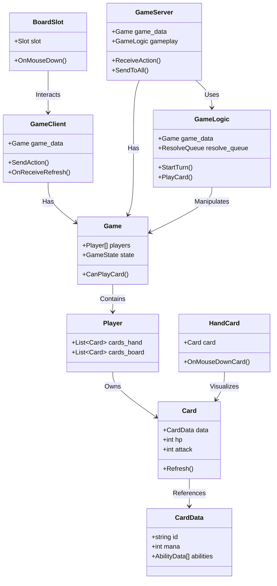
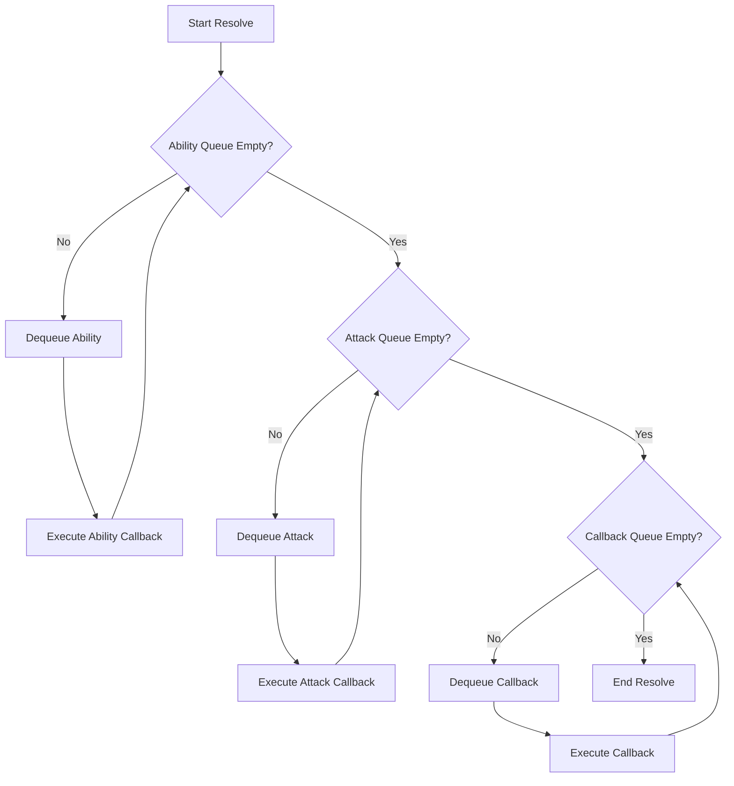
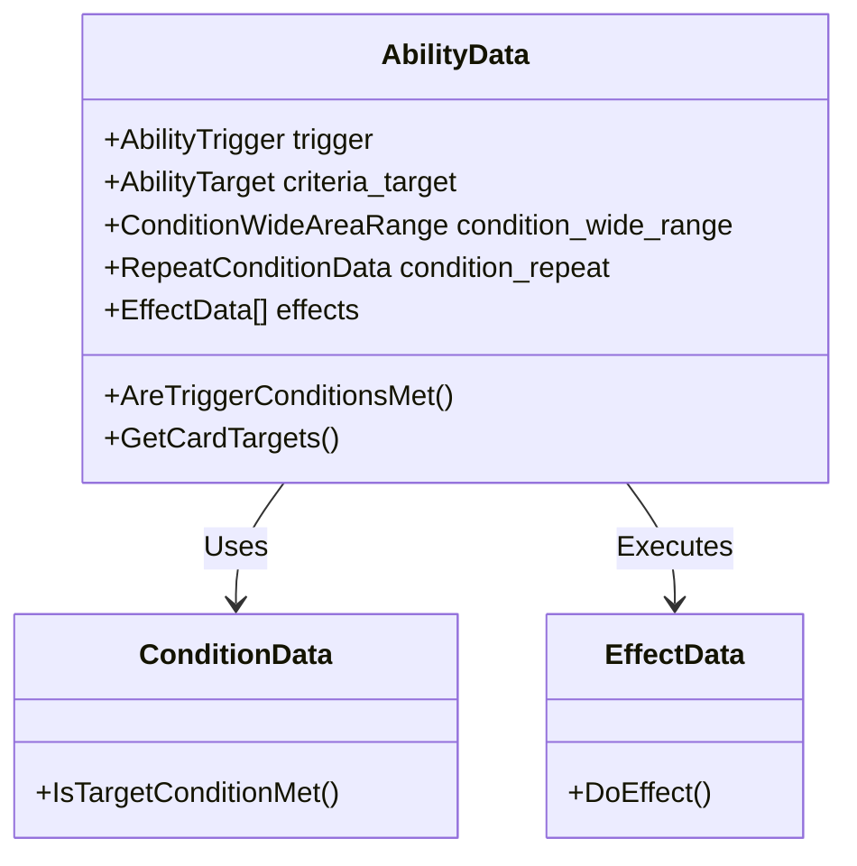
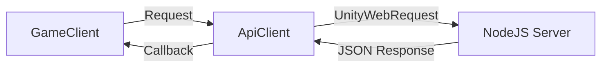
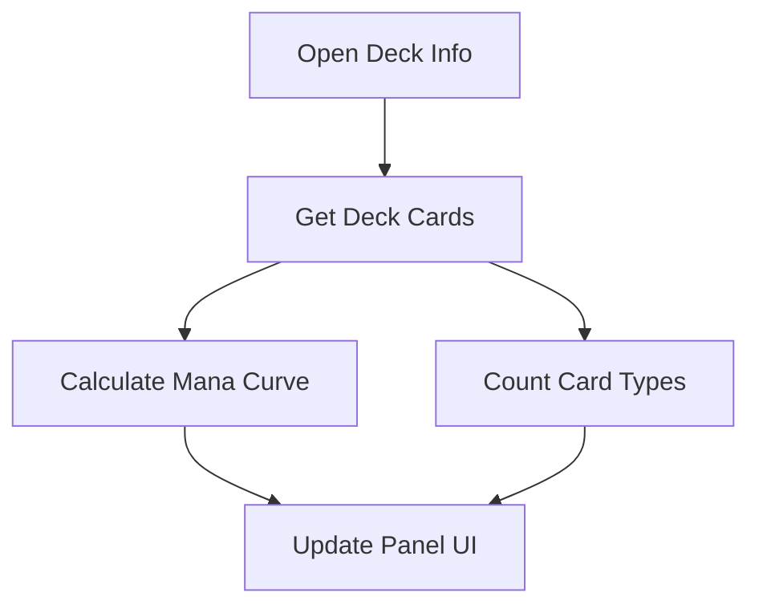
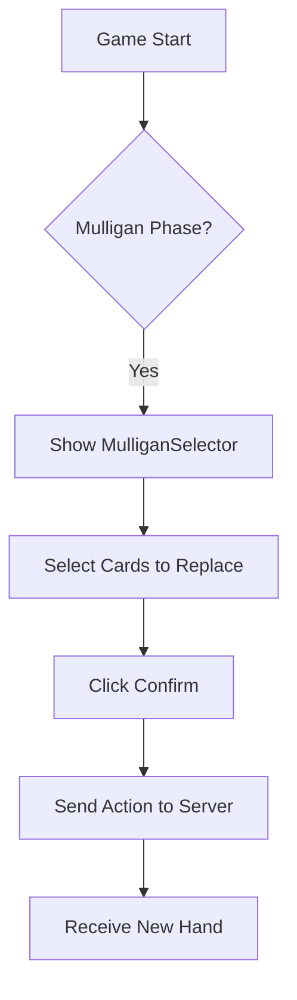
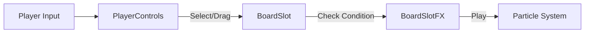

# CardArchive (카드아카이브)

## 1. 타이틀
### 프로젝트 개요
- **프로젝트 이름**: 카드아카이브
- **프로젝트 목표**: 넥슨의 블루아카이브 IP를 활용한 2차 창작 TCG 팬게임 개발 및 배포
- **프로젝트 기간**: 2023.10 - 2025.11 (개발 2024.06 - 2025.11)
- **역할**: 1인 개발 (기획, 개발, 리소스 아웃소싱, 일정 관리 등)

[](https://www.youtube.com/watch?v=YOUR_VIDEO_ID)

---

## 2. 게임 소개
### 레퍼런스 게임
- **하스스톤**: 카드 게임의 기본 규칙 및 마나 시스템
- **롤토체스 (TFT)**: 기물 배치 및 자동 전투 시스템

### 게임의 핵심 목표
- 상대 플레이어의 체력을 0으로 만들기

### 게임 특징
1. **전략적 배치 시스템**
   - 무기 타입과 공격 알고리즘을 통해 단순히 카드를 내는 것이 아닌 **어디에** 소환하는지가 중요
   - 

2. **동아리 시너지 시스템**
   - 모든 학생 카드는 소속 동아리가 있으며, 덱에 편성하는 학생에 따라 발동되는 동아리 효과가 결정됨
   - 인게임에서는 상시로 필드의 해당 부원수를 계산하여 효과를 발동하거나 적용함
   - 덱 다양성 증가 및 플레이의 다양성 증가
   - 

---

## 3. 구현 내용 소개

## 3. 구현 내용 소개

### 1) 기존 시스템 분석

#### 게임 프레임워크 분석
- **GameClient**와 **GameServer** 간의 통신 및 주요 클래스 관계
- `GameClient`는 유저 입력을 처리하고 서버와 통신하며, `GameServer`는 `GameLogic`을 통해 게임 규칙을 수행합니다.
- `Game` 객체는 게임의 모든 상태 데이터(플레이어, 카드 등)를 담고 있으며 네트워크로 동기화됩니다.



#### ResolveQueue 분석
- **ResolveQueue**는 효과의 누락 없는 순차적 적용을 보장하기 위해 사용됩니다.
- Ability, Attack, Callback 등 다양한 액션을 큐에 담아 우선순위에 따라 순차적으로 처리합니다.



### 2) 리팩토링 작업 소개

#### Ability 구조 변경
- 복잡한 타겟팅과 범위 효과를 지원하기 위해 `AbilityData` 구조를 개선했습니다.



#### 덱 구조 리팩토링
- `DeckData`에 `clubs` 배열을 추가하여 동아리 시너지 정보를 포함하고, 게임 시작 시 이를 로드하여 시너지를 적용합니다.

### 3) 신규 시스템 구현

#### 라이브 웹 서비스 구축
- `UnityWebRequest`를 사용하여 NodeJS 서버와 통신하며 로그인 및 매치메이킹을 수행합니다.



#### 마나 필터링 시스템 (Observer Pattern)
- 옵저버 패턴을 활용하여 마나 필터 버튼 클릭 시 UI가 자동으로 업데이트됩니다.

```mermaid
flowchart LR
    User[User Click] --> Filter[ManaFilter (Subject)]
    Filter -->|Notify| Item[ManaFilterItem (Observer)]
    Item -->|Check Filter| UI[Update UI Active/Inactive]
```

#### 덱 인포 UI
- 덱의 마나 커브와 카드 비율을 시각화하여 보여줍니다.



#### 초기 카드 교환 시스템 (Mulligan)
- 게임 시작 시 카드를 교체하는 멀리건 단계를 구현했습니다.



#### 튜토리얼 시스템 (Singleton)
- 싱글톤 패턴으로 구현된 튜토리얼 매니저가 플레이어의 행동을 제어합니다.

```mermaid
flowchart TD
    Event[Game Event (Click/Play)] --> Tuto[Tutorial Singleton]
    Tuto --> CheckStep{Is Action Allowed?}
    CheckStep -- Yes --> Allow[Execute Action]
    CheckStep -- No --> Block[Block Action & Show Warning]
    Allow --> NextStep[Advance Tutorial Step]
```

#### Slot 강조 FX 시스템
- 플레이어의 상태(드래그, 타겟팅 등)에 따라 슬롯의 시각 효과를 변경합니다.



#### WeaponType 설계 (Strategy Pattern)
- 무기 타입에 따라 공격 범위와 대상을 찾는 알고리즘을 전략 패턴으로 유연하게 교체합니다.

```mermaid
flowchart TD
    Attack[Attack Trigger] --> GetWeapon[Get Weapon Data]
    GetWeapon --> Search[SearchTarget()]
    Search -->|Strategy| List[Target List]
    List --> AttackFunc[AttackTarget()]
    AttackFunc --> Apply[Apply Damage/Effect]
```

#### 공격 페이즈 및 자동 공격 시스템
- 하스스톤 전장과 유사한 자동 공격 순서를 큐를 통해 처리합니다.

```mermaid
flowchart TD
    Start[Start Attack Phase] --> GetOrder[Get Attack Order (Slots)]
    GetOrder --> Loop{For Each Attacker}
    Loop --> CheckCanAttack{Can Attack?}
    CheckCanAttack -- Yes --> Search[AttackSearch]
    Search --> Resolve[Resolve Attack]
    Resolve --> Loop
    CheckCanAttack -- No --> Loop
    Loop -- Done --> End[End Phase]
```

---

## 4. 성과
- **2025년 10월**: 일러스타 페스 출품
- **2025년 4분기**: 배포 예정
