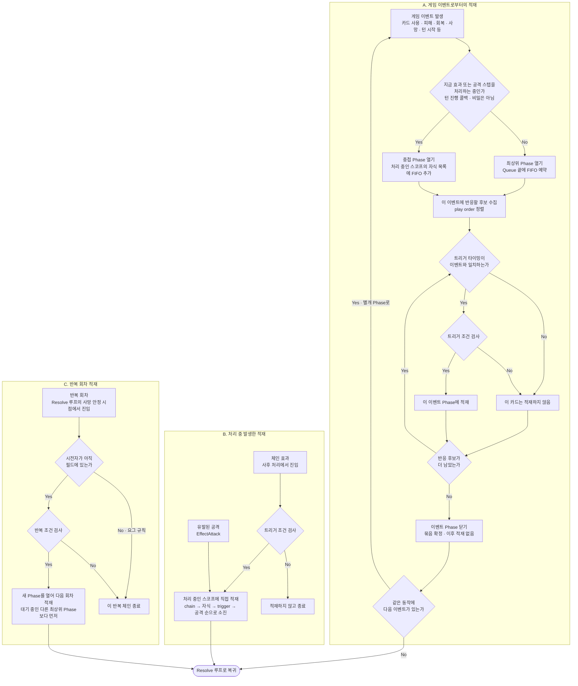
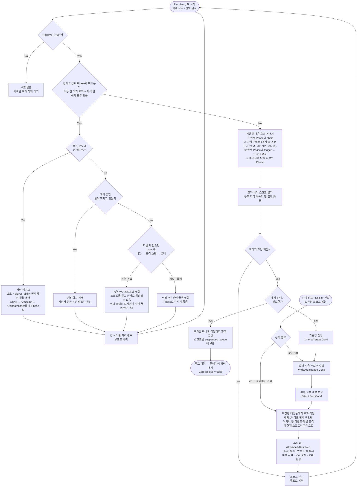

# 효과 처리 플로우 (적재 / Resolve)

최종 갱신: 2026-08-02 (Phase 3 개편 반영)

카드 효과가 **어떤 순서로 발동하고 언제 죽음이 처리되는지**를 그림과 예시로 정리한 문서다.
전투(공격 순서·타겟 지정)는 [`combat-flow.md`](combat-flow.md)에 있다.
설계 배경·하스스톤 규칙 인용·개편 이력은 [`resolve-queue-hearthstone-redesign.md`](resolve-queue-hearthstone-redesign.md)에 있고,
회귀 검증은 [`../Tools/ResolveQueueTests`](../Tools/ResolveQueueTests)에 있다 (`dotnet run`, 58종).

---

## 1. 용어

| 용어 | 뜻 |
|---|---|
| **이벤트(Event)** | 게임에서 일어난 하나의 사건 — 카드 사용, 피해, 회복, 사망, 턴 시작… |
| **Phase** | 한 이벤트에 반응하는 트리거 묶음. 또는 한 효과가 여는 처리 스코프 |
| **최상위 Phase** | 효과·공격 스텝을 처리하는 중이 **아닐 때** 열린 Phase. **이게 끝날 때만 죽음 처리** |
| **중첩 Phase** | 처리 중에 열린 Phase. 부모의 남은 항목보다 먼저 소진 |
| **Queue** | 최상위 Phase들의 대기열 (FIFO) |
| **빈사(mortally wounded)** | 체력 0 이하 또는 파괴 마킹됐지만 아직 보드에 남아 있는 상태 |
| **사망 웨이브** | 한 번의 Death Creation Step에서 동시에 제거되는 카드들 |

핵심 두 축:

| 관계 | 규칙 |
|---|---|
| 부모 ↔ 자식 (연쇄) | **자식이 먼저** — depth-first |
| 형제 ↔ 형제 (같은 레벨) | **먼저 만든 것이 먼저** — FIFO |

### ⚠️ 이름과 실제 자료구조가 다르다

`ResolveQueue`라는 이름과 "Queue" 용어는 개편 이전(낱개 효과 FIFO 대기열)의 잔재다.
**현재 실제 구조는 큐가 아니라 Phase 트리 + 실행 커서**다.

| 이름 | 실제 |
|---|---|
| `ResolveQueue` (클래스) | Phase 트리 + 실행 커서 |
| `phase_queue` | **덱** — 뒤로 추가(일반 이벤트) / 앞으로 삽입(죽음·반복 회차) |
| `current_top` | 트리 루트 커서 |
| `AbilityPhase.children` | **덱** — 뒤로 추가(형제 이벤트) / 앞으로 삽입(처리 스코프) |
| `AbilityPhase.chains / triggers / attacks` | 진짜 큐 ← **여기만 큐다** |
| `insert_stack` | 스택 (적재 대상 커서) |
| `secret / attack / callback_queue` | 진짜 큐 (개편 대상 아님) |

**왜 큐로는 안 되나.** 큐는 하나의 전체 순서만 준다. 그런데 필요한 건 두 부분 순서의
합성(중첩 축 depth-first + 형제 축 FIFO)이고, 이건 정의상 트리 순회다. 평평한 스택으로
두 축을 하나의 LIFO에 욱여넣었던 것이 개편 전 형제 순서 역전 버그의 원인이었다.

**왜 그냥 재귀로 안 했나.** 하스스톤 규칙은 문자 그대로 재귀지만("nested Phases start and
end inside of it"), 이 프로젝트는 콜 스택을 쓸 수 없다 — 연출 딜레이(`Update(delta)`로
프레임을 넘김), selector(플레이어 입력 대기로 중단·재개), AI 동기 구동이 같은 코드를 탄다.
**이 트리는 중단 가능한 콜 스택을 자료구조로 편 것**이다.

이름 정리(내부 필드명 / 클래스명 개명)는 보류 상태다. 코드를 읽을 때 "큐"라는 단어에
낚이지 말 것.

---

## 2. 적재 플로우차트



### 읽는 법

- **`EndPhase`는 Phase를 없애는 게 아니다.** "이 묶음에 더 이상 적재하지 않겠다"는 뜻이고,
  내용물이 있으면 살아남아 순서대로 소진된다. 소멸은 안이 다 비었을 때.
- **`W`가 갈림길**이다. 처리 중이 아니면 최상위(FIFO 대기열), 처리 중이면 중첩(자식 목록).
  턴 진행 콜백(`DrawForTurn`, `StartMainPhase`…)은 "처리 중"으로 치지 않는다 — 그래야
  콜백 안에서 뜬 이벤트들이 각자 최상위가 되어 사이에 죽음 처리가 돈다.
- **`RY`가 요그사론 규칙**이다. 시전자가 회차 도중 필드를 떠나면 남은 회차를 버린다.

---

## 3. Resolve 플로우차트



### 읽는 법

- **`Q2`가 사망 처리의 유일한 관문**이다. "현재 최상위 Phase가 비었는가" — 묶음 안에
  아직 발동 안 한 형제가 남아 있으면 `No`라서 죽음이 처리되지 않는다.
- **`PICK`의 ①이 ②보다 앞**인 게 중요하다. 어빌리티의 chain(후속 텍스트)은 그 어빌리티가
  **자기가 유발한 이벤트보다도** 먼저 와야 한다.
- **`ATK`가 특이 케이스**다. 공격 마이크로스텝은 Sequence 골격이 아니라 **Phase 자체**라
  (하스스톤의 'Preparation' / 'Attack' Phase), 스코프를 만든 즉시 최상위로 잡아 죽음 게이트를
  막는다. 그래야 `OnAfterDamage` 같은 트리거가 사망 처리보다 먼저 발동한다.
- **`APPLY`에서는 아무도 죽지 않는다.** 체력이 0이 되어도 빈사 마킹만 하고 보드에 남는다.
- **`APPLY`와 `POST`가 적재하는 게 다르다.** 피해·회복으로 뜨는 **이벤트**와 `EffectAttack`이
  거는 **유발 공격**은 `APPLY`(효과 적용) 중에 생긴다. `POST`(`AfterAbilityResolved`)가 하는
  적재는 **chain 등록과 반복 회차** 두 가지뿐이다. 원본 기획서의 "Chain Ability 및 연쇄 효과
  적재"에서 "연쇄 효과"는 chain을 가리킨다.
- **대상 선택은 루프를 끊는다.** `SEL → PARK`가 종단이고, `RESUME`은 들어오는 화살표가 없는
  **외부 진입점**이다 (플레이어 입력). `START`와 같은 성격.

### 대상 선택의 중단·재개

```
① 효과 resolve 시작
② 대상 선택 필요 → 효과를 **하나도 적용하지 않고** return
      (ResolveCardAbility가 ResolveCardAbilityXxx / AfterAbilityResolved 전부 건너뜀)
③ ResolveQueue가 그 효과의 스코프를 suspended_scope로 보존
④ CanResolve() = false → 루프 정지
   ─────────── 플레이어 입력 대기 ───────────
⑤ SelectCard 진입
      BeginPhase()              보존 스코프 복원 (적재 플로우가 아니라 그대로 다시 엶)  → RESUME
      ResolveEffectTarget(...)  선택한 대상에 효과를 **바로 적용**                      → APPLY
      AfterAbilityResolved(...) chain·반복 등록                                         → POST
      EndPhase()                                                                        → CLOSE
⑥ ResolveAll() → 루프 재개                                                             → START
```

**`RESUME`이 `기준점 선정`으로 가지 않는 이유**: 기준점 선정(Criteria Target Cond)은
"어떤 대상을 후보로 삼을까"를 고르는 단계인데, **플레이어의 선택이 그걸 대신한다.**

그다음이 선택 종류에 따라 갈린다:

| 선택 종류 | 재진입 지점 | 코드 |
|---|---|---|
| **슬롯 선택** (`SelectSlot`) | `효과 적용 후보군 수집` (C2) | `Slot.GetAll()` 순회 + `AreWideRangeConditionsMet(caster, 선택슬롯, 후보슬롯)` — 상대좌표 확장이 살아 있다 (`GameLogic.cs:3108-3118`) |
| **카드 선택** (`SelectCard`) | `확정된 대상들에게 효과 적용` (APPLY) | `ResolveEffectTarget(ability, caster, target)` 한 번 (`:3016`, `:3032`) |
| **플레이어 선택** (`SelectPlayer`) | 같음 (APPLY) | `:3068` |

### ⚠️ 선택 경로가 파이프라인을 부분적으로만 재현한다

| | C1 기준점 | C2 WideArea | C3 조건 | C3 필터/정렬 |
|---|---|---|---|---|
| 자동 대상 지정 (`GetCardTargets`) | ✔ | ✔ | ✔ | ✔ |
| 슬롯 선택 | 플레이어가 대체 | ✔ | ✔ | **✘** |
| 카드 선택 | 플레이어가 대체 | **✘** | **✘** | **✘** |
| 플레이어 선택 | 플레이어가 대체 | **✘** | **✘** | **✘** |

**"대상 하나를 선택 → 그 주변 1칸에도 효과"** 같은 카드를 **카드 선택**으로 만들면
`condition_wide_range`가 조용히 무시된다. 슬롯 선택으로 만들어야 동작한다.
자동 대상 지정은 확장하는데 카드 선택만 안 하는 비대칭이라 버그로 보이지만,
"범위 효과는 슬롯 선택 전용"이 기획 의도일 수도 있어 판단이 필요하다.
(이건 resolve 순서가 아니라 **대상 지정 로직** 문제라 Phase 3 개편 범위 밖이다.)

**효과 적용 자체는 적재 플로우를 타지 않는다.** `SelectCard`가 제자리에서 직접 실행한다.
적재 플로우를 타는 건 그 결과로 생긴 것들뿐이다 — 유발된 이벤트(A레인), chain·반복(B/C레인).

다시 적재하는 설계였다면 그 효과가 큐에 다시 줄을 서서 대기 중이던 형제들과의 순서가
달라졌을 것이다. 지금은 중단이 없었을 때와 순서가 같다 (검증 `E30`).

스코프를 보존하는 이유도 같다. `SelectCard`는 루프 밖에서 호출되므로 `insert_stack`이
비어 있고, 복원하지 않으면 **새 최상위 Phase**가 만들어져 재개된 효과의 연쇄가 대기 중이던
형제들 **뒤로 밀린다**. 개편 전(평평한 스택)에는 새 Phase가 top에 쌓여 우연히 맞았지만,
최상위가 FIFO가 된 지금은 명시적 복원이 필요하다.

> **예외**: `ability.trigger == OnPlay`인 경우(대상을 지정하며 내는 카드)만 스코프 복원이
> 아니라 `PlayCard`를 처음부터 다시 실행한다 (`GameLogic.cs:3013` 부근). 이 경로는
> `RESUME` 이후 적재 차트의 `EV`(게임 이벤트 발생)로 들어간다.

---

## 4. 대표 시나리오

카드 한 장을 내는 것만으로 규칙 5개가 전부 드러나는 예시다.
(`Tools/ResolveQueueTests/Showcase.cs` — 실행하면 이 표가 그대로 출력된다)

### 상황

| | |
|---|---|
| **내 필드** | 곡예사甲, 곡예사乙 — 둘 다 `OnPlayOther` 보유 (먼저 낸 순서: 甲 → 乙) |
| **적 필드** | 적A (체력 1, 죽메: 내 유닛 강화), 적B (체력 **2**, 죽메: 카드 1장 뽑기) |
| **하는 일** | 손에서 **신입생**을 낸다 — `OnPlay`: "적A에 1 피해" |
| 곡예사甲 | `OnPlayOther`: "적B에 1 피해" — 그리고 **자신의 `OnAfterDamage`**: "적B에 1 더 피해" |
| 곡예사乙 | `OnPlayOther`: "**적 유닛 수만큼** 회복" |

곡예사甲은 **효과를 적용하는 도중에 자기 다른 효과를 유발한다**(피해 → `OnAfterDamage`).
중첩(depth-first)이 어떻게 처리되는지를 이 카드가 보여준다.

### 진행

| # | 개편 전 | 개편 후 |
|---|---|---|
| 1 | 신입생 OnPlay — 적A에 1 피해 | 신입생 OnPlay — 적A에 1 피해 |
| 2 | **[사망 웨이브] 적A** | **[사망 웨이브] 적A** |
| 3 | 적A 죽메 — 내 유닛 강화 | 적A 죽메 — 내 유닛 강화 |
| 4 | 곡예사甲 — 적B에 1 피해 (2→1) | 곡예사甲 — 적B에 1 피해 (2→1) |
| 5 | ↳ 甲 OnAfterDamage — 적B에 1 더 (1→0) | ↳ 甲 OnAfterDamage — 적B에 1 더 (1→0) |
| 6 | **[사망 웨이브] 적B** ← 묶음 중간에 끼어듦 | **곡예사乙 — 적 1명만큼 회복** ← 빈사인 적B가 세어짐 |
| 7 | 적B 죽메 — 카드 1장 뽑기 | **[사망 웨이브] 적B** ← 묶음이 다 빈 뒤 |
| 8 | ↳ 드로우 반응 트리거 | 적B 죽메 — 카드 1장 뽑기 |
| 9 | **곡예사乙 — 적 0명만큼 회복** ← 맨 뒤로 밀림 | ↳ 드로우 반응 트리거 |

`↳` 는 **효과 적용 중에 유발된 중첩 효과**다. 스텝 5(甲의 피해가 깨운 `OnAfterDamage`)와
스텝 8~9(죽메가 일으킨 드로우 → 드로우 반응)가 그렇다.

### 이 장면에 담긴 규칙 5개

**① 이벤트 사이에는 사망 처리가 돈다** (스텝 2)
`OnPlay`(카드 자기 텍스트)와 `OnPlayOther`(타 카드 반응)는 카드 플레이 Sequence의 **별개
Phase**라 그 사이에서 적A가 죽는다. 개편 전후 동일하고, 하스스톤도 그렇다.

**② 죽메는 대기 중인 다음 이벤트보다 먼저** (스텝 3)
적A의 죽메가 아직 발동 안 한 `OnPlayOther`보다 앞선다 (`BeginImmediatePhase`).

**③ 효과 적용 중 유발된 효과는 대기 중인 형제보다 먼저** (스텝 5) — *depth-first*
곡예사甲이 피해를 주는 **도중에** 자신의 `OnAfterDamage`가 깨어난다. 이건 甲의 **자식**이라
아직 발동 안 한 형제(곡예사乙)를 제치고 바로 처리된다. 甲의 연쇄가 완전히 끝나야 乙 차례다.
**이 규칙은 개편 전에도 정상이었다** — 중첩 축은 원래 맞았고, 깨져 있던 건 형제 축이다.

**④ 한 이벤트에 반응하는 카드들 사이에는 사망 처리가 없다** (스텝 5→6)
곡예사 두 장은 같은 `OnPlayOther` 이벤트의 한 묶음이다. 甲의 연쇄가 적B를 빈사로 만들어도
乙이 발동할 때까지 적B는 보드에 남는다.

> "All Knife Juggler effects are handled before **any** of their deaths are detected and
> processed." — Hearthstone Wiki, Knife Juggler

**⑤ 그래서 빈사 카드가 대상 수에 잡힌다** (스텝 6)
곡예사乙이 **"적 1명"**을 센다. 개편 전에는 적B가 이미 제거된 뒤라 **0명**이었다.

### 개편 전이 왜 문제였나

반응 카드가 낱개로 적재돼 **각자가 최상위 Phase**였다. 그래서 —

- 곡예사甲의 연쇄가 끝나자마자 **사망 웨이브가 끼어들었고**(④ 위반, 스텝 6)
- 그 여파로 적B의 죽메와 드로우 연쇄까지 전부 乙보다 앞서 터졌으며(스텝 7·8)
- 결국 곡예사乙은 텅 빈 보드를 보고 회복량 **0**이 됐다(⑤ 위반, 스텝 9)

주목할 점은 **스텝 4→5(중첩)는 개편 전에도 똑같았다**는 것이다. 문제는 항상 **형제 축**
— "같은 이벤트에 반응한 카드들을 하나로 묶는가" — 하나였다.

**카드 발동 순서만 바뀌는 게 아니라 효과 수치 자체가 1 → 0으로 달라진다.**
이번 개편으로 실제 게임플레이가 바뀌는 지점이다.

---

## 5. 자주 헷갈리는 지점

| 질문 | 답 |
|---|---|
| 턴시작 효과 A(광역)로 적이 죽었다. 턴시작 효과 B보다 죽메가 먼저인가? | **아니다.** A와 B는 턴시작이라는 한 이벤트의 묶음이라 B가 먼저다. 죽음은 묶음이 다 빈 뒤 |
| A가 유발한 연쇄 C는 B보다 먼저인가? | **먼저다.** 자식이 형제보다 우선 (depth-first) |
| 그럼 순서는? | `A → C → B → 사망 웨이브 → 죽메` |
| A가 죽인 카드와, A가 유발한 C가 죽인 카드는 같은 웨이브인가? | **같은 웨이브다.** 둘 다 같은 최상위 Phase 안에서 죽었다 |
| 턴 시작 드로우는 언제? | 턴시작 효과와 그 연쇄, 사망 처리가 **전부** 끝난 뒤 (콜백이라 모든 Phase 뒤) |
| 반복 효과(모독)는 대기 중인 다른 효과보다 먼저인가? | 다른 **이벤트**보다는 먼저. 같은 묶음 안 **형제**보다는 뒤 |

---

## 6. 코드 진입점

| 관심사 | 위치 |
|---|---|
| Phase 자료구조 / 소진 우선순위 | `Assets/TcgEngine/Scripts/Tools/ResolveQueue.cs` — `AbilityPhase`, `FindNextPhase`, `Resolve` |
| 최상위 Phase 큐 / 죽음 경계 | `ResolveQueue.phase_queue`, `current_top` |
| 이벤트 묶음을 여는 곳 | `GameLogic.TriggerCardAbilityType`(2종), `TriggerOtherCardsAbilityType`, `TriggerPlayerCardsAbilityType` |
| 이벤트가 호출 2번에 걸치는 곳 | `StartGame`(OnGameStart), `BeforeMainPahse`(StartOfTurn), `EndTurn`(EndOfTurn) |
| 죽음 페이즈 | `GameLogic.ProcessDeathStep` / `HasPendingDeaths` / `IsDying` / `MarkDying` |
| 반복 회차 | `GameLogic.AfterAbilityResolved` → `ProcessPendingRepeats` (요그 규칙 포함) |
| selector 중단·재개 | `ResolveQueue.suspended_scope` ↔ `GameLogic.SelectCard/SelectPlayer/SelectSlot/SelectChoice` |
| 유발된 공격 | `Effects/EffectAttack.cs` → `GameLogic.AttackTargetFromEffect` → `ResolveQueue.AddTriggeredAttack` |
