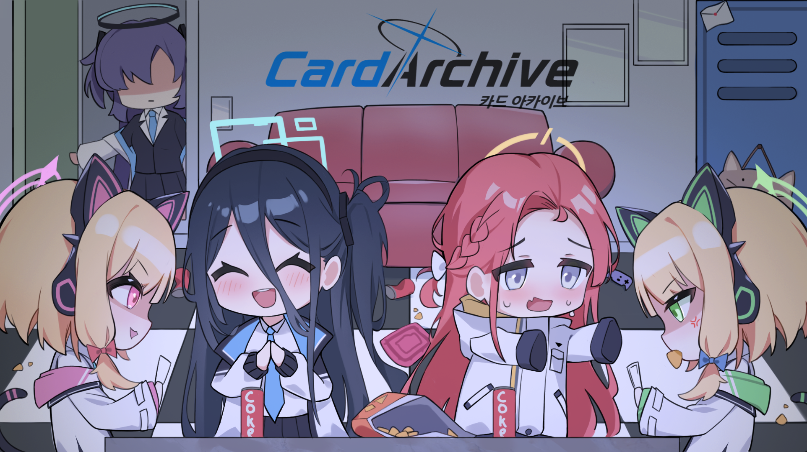

# Card Archive (카드아카이브) 

---

## 프로젝트 개요

**프로젝트 이름**  
- 카드아카이브 (넥슨의 블루아카이브 IP를 활용한 2차 창작 팬게임)

**프로젝트 기간**  
- **기획:** 2023.10 ~ 2024.06
- **개발:** 2024.06 ~ 2025.11

**프로젝트 인원**  
- 1인 프로젝트

**맡은 역할**  
- **기획**: 게임 디자인 기획, UI/UX 기획, 카드 기획, 밸런스
- **개발**: 로직 리팩토링 및 신규 시스템 추가, 다양한 연출 및 UI/UX 개선
- **리소스 아웃소싱**: 디자이너 컨택 및 요청서 작성, 품질 검수, 정산

---

## 프로젝트 소개

블루아카이브 IP의 다양한 동아리 및 학생들을 활용한 TCG 게임

**기존 TCG 포맷과의 차이점**

- **무기 타입과 자동 공격 알고리즘을 통한 배치의 전략성**  
   유닛의 무기 타입에 따라 공격 범위가 달라지며, 자동 공격 알고리즘이 유닛의 배치와 관련하여 전략적 선택에 영향을 줌

- **동아리 조합을 통한 덱 다양성 확보 및 필드 시너지 효과**  
   다양한 동아리를 조합하여 덱을 구성하고, 해당 동아리의 시너지 효과를 적용할 수 있음

---

## 개발 환경 및 서버 아키텍쳐

**개발 환경**  
Unity 2022.3.32.f1

**서버 아키텍쳐**  
AWS EC2 (t2.micro)

**웹서버 주소**  
https://your-domain.com

---

## 주요 기능

### Ability 구조 리팩토링

필드 효과 시스템을 개선하여 보다 유연한 능력 설정이 가능하도록 구조를 재설계

- **타일 기반 효과 처리**: 필드에 적용하는 효과는 배치된 유닛이 아닌, 타일 자체를 기준으로 선택하여 처리
- **ConditionData 반복 설정**: 능력의 반복을 설정할 수 있는 `ConditionData`를 구현
- **필드 기준점 범위 지정**: 필드의 기준점을 (0, 0)으로 삼아 범위를 지정할 수 있는 `ConditionData`를 추가

### AttackPhase 추가

유닛별 다양한 공격 타입을 지원하는 전투 시스템을 구현

- **무기 타입 클래스 설계**: `WeaponData`를 `Scriptable Object`로 만들어, 다양한 무기 타입을 만들고 유닛에게 지정할 수 있음 
- **추상 클래스 활용**: 공격 사거리와 공격 대상 탐색 알고리즘을 무기 타입 별로 다르게 설정할 수 있음, 새로운 무기 타입 추가가 용이함
- **ResolveQueue 처리**: `ResolveQueue` 활용을 통해 공격 중 발생하는 효과를 순차적으로 처리

### UI/UX 개편

플레이어 경험을 개선하기 위한 다양한 UI/UX 시스템을 구현

- **타일 강조 UX**: `전략 디자인 패턴`을 적용하여 플레이어의 현재 입력에 맞춰 적절한 타일 강조 FX 효과를 출력
- **덱 인포 UI**: 현재 덱 상태에 맞춰 마나 커브 및 카드 타입별 비율을 보여줌
- **마나 필터**: `옵저버 디자인 패턴`을 적용하여 덱 에디터에서 선택한 마나에 맞는 카드만 필터링하는 기능을 추가

### 기타

- **멀리건 페이즈**: 초기 드로우 시, 유저가 선택한 카드를 버리고 다시 뽑는 멀리건 페이즈를 추가
- **튜토리얼**: 플레이어의 입력마다, 튜토리얼 매니저에 접근하여 유효한 입력만 통과하는 튜토리얼 기능을 구현

---

## 기술 스택

**게임 엔진**  
Unity 2022.3.32.f1

**네트워크 및 통신**  
NetCode, WebResponse

**데이터 관리**  
ScriptableObject (Ability Data, ConditionData, EffectData)

**최적화**  
Object Pooling (Queue Element)

**애니메이션**  
DOTween

**형상 관리**  
Github

---

## 라이선스

이 프로젝트는 넥슨의 블루아카이브 IP를 활용한 2차 창작 팬게임입니다.  
모든 블루아카이브 관련 지적 재산권은 넥슨에 있습니다.
