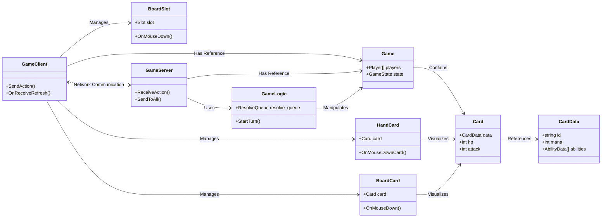
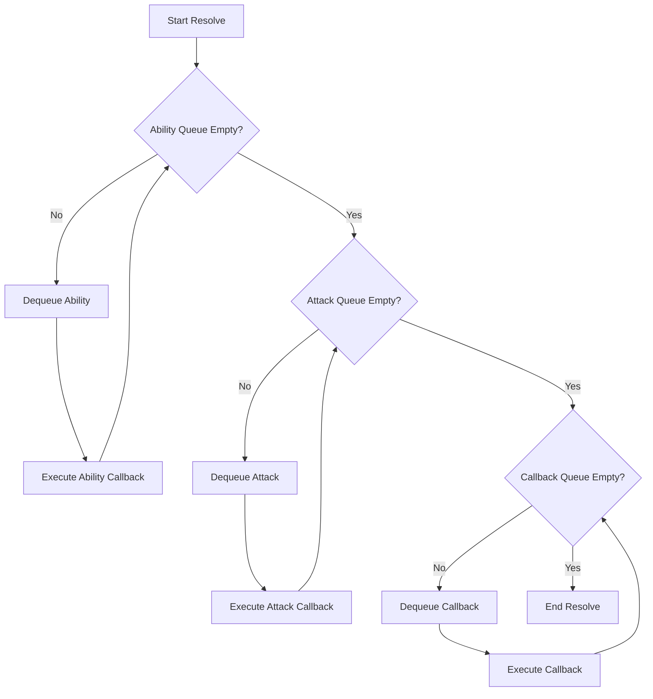
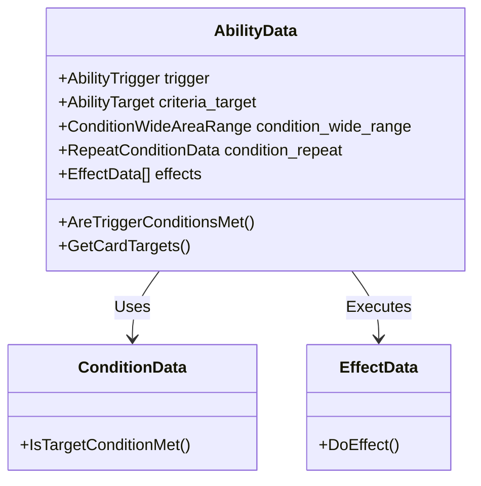
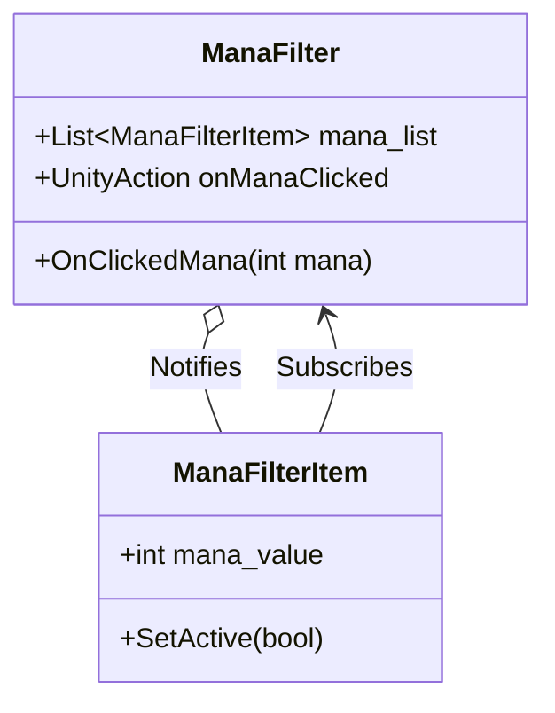
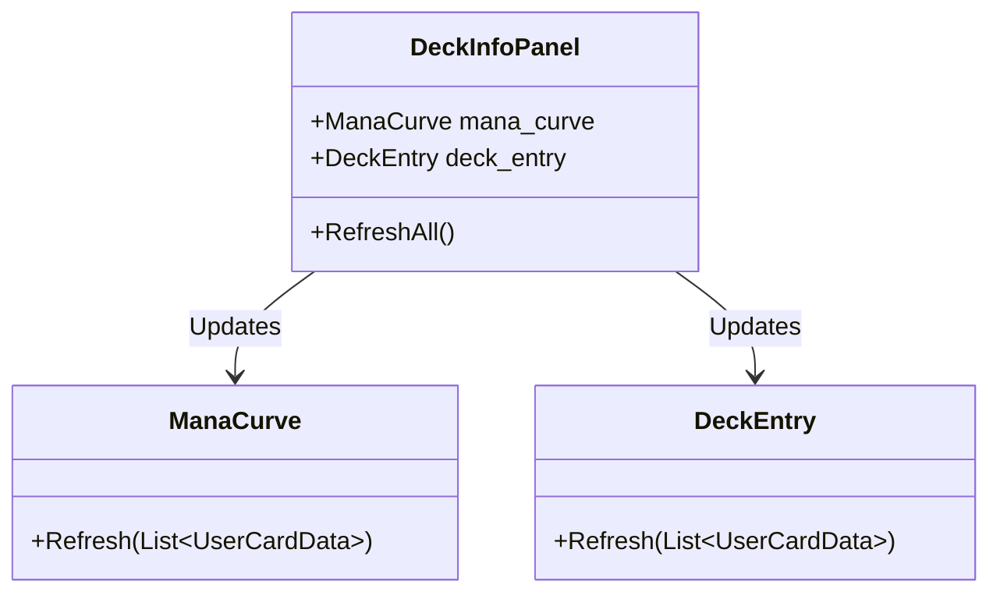
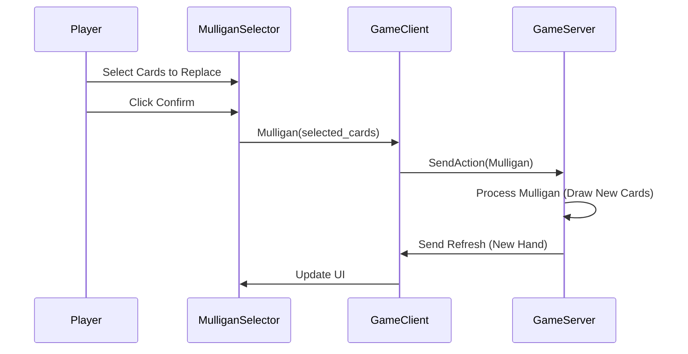

# CardArchive (카드아카이브)

## 1. 타이틀
### 프로젝트 개요
- **프로젝트 이름**: 카드아카이브
- **프로젝트 목표**: 넥슨의 블루아카이브 IP를 활용한 2차 창작 TCG 팬게임 개발 및 배포
- **프로젝트 기간**: 2023.10 - 2025.11 (개발 2024.06 - 2025.11)
- **역할**: 1인 개발 (기획, 개발, 리소스 아웃소싱, 일정 관리 등)

[](https://www.youtube.com/watch?v=YOUR_VIDEO_ID)

---

## 2. 게임 소개
### 레퍼런스 게임
- **하스스톤**: 카드 게임의 기본 규칙 및 마나 시스템
- **롤토체스 (TFT)**: 기물 배치 및 자동 전투 시스템

### 게임의 핵심 목표
- 상대 플레이어의 체력을 0으로 만들기

### 게임 특징
1. **전략적 배치 시스템**
   - 무기 타입과 공격 알고리즘을 통해 단순히 카드를 내는 것이 아닌 **어디에** 소환하는지가 중요
   - 

2. **동아리 시너지 시스템**
   - 모든 학생 카드는 소속 동아리가 있으며, 덱에 편성하는 학생에 따라 발동되는 동아리 효과가 결정됨
   - 인게임에서는 상시로 필드의 해당 부원수를 계산하여 효과를 발동하거나 적용함
   - 덱 다양성 증가 및 플레이의 다양성 증가
   - 

---

## 3. 구현 내용 소개

### 1) 기존 시스템 분석

#### 게임 프레임워크 분석
- **GameClient**와 **GameServer** 간의 통신 및 주요 클래스 관계
- 클라이언트는 `GameClient`를 통해 서버에 액션(`GameAction`)을 전송하고, 서버는 `GameServer`에서 로직을 처리한 후 결과를 모든 클라이언트에게 `Refresh` 이벤트로 전송



#### ResolveQueue 분석
- **ResolveQueue**는 효과의 누락 없는 순차적 적용을 보장하기 위해 사용됩니다.
- Ability, Attack, Callback 등 다양한 액션을 큐에 담아 우선순위에 따라 순차적으로 처리합니다.
- 오브젝트 풀링(`Pool<T>`) 기법을 사용하여 메모리 할당을 최소화했습니다.



### 2) 리팩토링 작업 소개

#### Ability 구조 변경
- **변경 이유**: 복잡한 효과 구현(반복 조건 설정, Slot 기반 효과 발동 등)을 위해 기존의 단순한 타겟팅 구조를 개선할 필요가 있었습니다.
- **변경 내용**:
    - `Target`을 `Criteria Target`으로 변경하여 기준점 Slot을 설정
    - `WideAreaTargetCondition`을 추가하여 기준점으로부터의 범위 지정 기능 구현
    - `RepeatCondition`을 통해 반복 기능 구현



#### 덱 구조 리팩토링
- 편성된 학생에 따라 동아리 효과가 덱에 저장되고, 게임 시작 시 세팅되도록 변경했습니다.
- `DeckData`에 `clubs` 배열을 추가하여 동아리 시너지 정보를 포함시켰습니다.

### 3) 신규 시스템 구현

#### 라이브 웹 서비스 구축
- `UnityWebRequest`를 사용하여 NodeJS 서버와 통신하며, 카드 정보 및 이미지를 주고받는 라이브 웹 서비스를 구축했습니다.

```mermaid
flowchart LR
    Client[GameClient] -->|Request (Login/Match/Data)| Api[ApiClient]
    Api -->|UnityWebRequest (POST/GET)| Node[NodeJS Server]
    Node -->|JSON Response| Api
    Api -->|Callback (Action)| Client
```

#### 마나 필터링 시스템 (Observer Pattern)
- 옵저버 디자인 패턴을 사용하여 마나 필터 UI를 구현했습니다.
- `ManaFilter`가 Subject 역할을 하며, 마나 버튼 클릭 시 `onManaClicked` 이벤트를 통해 `ManaFilterItem`들에게 알림을 보냅니다.



#### 덱 인포 UI
- 덱 정보를 분석하여 마나 커브 및 카드 타입별 비율을 확인할 수 있는 모듈화된 UI를 구현했습니다.



#### 초기 카드 교환 시스템 (Mulligan)
- 게임 시작 시 초기 패를 교환하는 멀리건 페이즈를 구현했습니다.



#### 튜토리얼 시스템 (Singleton)
- 싱글톤 패턴 기반의 `Tutorial` 시스템을 구축하여, 현재 단계에 맞게 플레이어의 입력을 제한하고 안내합니다.

#### Slot 강조 FX 시스템 (Strategy Pattern)
- 전략 디자인 패턴을 사용하여 플레이어의 행동(드래그, 타겟팅, 대기 등)에 따라 달라지는 Slot 강조 FX 시스템을 구현했습니다.

#### WeaponType 설계
- 사거리와 탐색 알고리즘을 별도로 지정할 수 있는 확장이 용이한 `WeaponType` 구조를 설계했습니다.
- `WeaponData`를 상속받아 다양한 공격 방식을 유연하게 추가할 수 있습니다.

#### 공격 페이즈 및 자동 공격 시스템
- 커스텀 Queue 자료 구조를 활용하여 '하스스톤 전장'과 유사한 자동 공격 페이즈를 구현했습니다.
- `GameLogic`에서 공격 순서를 계산하고 큐에 넣어 순차적으로 공격을 수행합니다.

---

## 4. 성과
- **2025년 10월**: 일러스타 페스 출품
- **2025년 4분기**: 배포 예정