# CardArchive (카드아카이브)
[](https://www.youtube.com/watch?v=CyvX_-qx0WI)
※ 클릭 시 플레이 영상으로 이동합니다.

## 목차
1. [프로젝트 개요](#프로젝트-개요)
2. [게임 소개](#게임-소개)
3. [구현 내용 소개](#구현-내용-소개)
4. [성과](#성과)

## 프로젝트 개요
- **프로젝트 이름**: 카드아카이브
- **프로젝트 목표**: 넥슨의 블루아카이브 IP를 활용한 2차 창작 TCG 팬게임 개발 및 배포
- **프로젝트 기간**: 2023.10 - 2025.11 (개발 2024.06 - 2025.11)
- **역할**: 1인 개발 (기획, 개발, 리소스 아웃소싱, 일정 관리 등)

---

## 게임 소개
### 레퍼런스 게임
- **하스스톤**: 카드 게임의 기본 규칙 및 마나 시스템
- **롤토체스 (TFT)**: 타일 시스템 및 시너지 시스템

### 게임의 핵심 목표
- 상대 플레이어의 체력을 0으로 만들기

### 게임 특징
1. **전략적 배치 시스템**
   - 타일 시스템과 사거리를 통해 단순히 카드를 내는 것이 아닌 **어디에** 소환하는지가 중요

        

2. **동아리 시너지 시스템**
   - 모든 학생 카드는 소속 동아리가 있으며, 덱에 편성하는 학생에 따라 발동되는 동아리 효과가 결정됨
   - 인게임에서는 상시로 필드의 해당 부원수를 계산하여 효과를 발동하거나 적용함
   - 덱 다양성 증가 및 플레이의 다양성 증가
   
        

---

## 구현 내용 소개

### 기존 시스템 분석

#### 게임 프레임워크 분석
- **GameClient**와 **GameServer** 간의 통신 및 주요 클래스 관계
- 클라이언트는 `GameClient`를 통해 서버에 액션(`GameAction`)을 전송하고, 서버는 `GameServer`에서 로직을 처리한 후 결과를 모든 클라이언트에게 `Refresh` 이벤트로 전송


#### ResolveQueue 분석
- **ResolveQueue**는 효과의 누락 없는 순차적 적용을 보장하기 위해 사용됩니다.
- 다양한 액션을 `Ability`, `Attack`, `Callback`으로 구분하여 큐에 담아 우선순위에 따라 순차적으로 처리합니다.
- 오브젝트 풀링(`Pool<T>`) 기법을 사용하여 메모리 할당을 최소화했습니다.


### 리팩토링 작업 소개

#### Ability 구조 변경
- **변경 이유**: 
    - 범위 지정으로 전략성을 높일 수 있는 효과를 만들 수 없음
    - 효과가 1회성으로 끝나고 반복을 시킬 수 없음

- **변경 내용**:
    - `Target`을 `Criteria Target`으로 변경하여 기준점 Slot을 설정
    - `WideAreaTargetCondition`을 추가하여 기준점으로부터의 범위 지정 기능 구현
    - `RepeatCondition`을 통해 반복 기능 구현

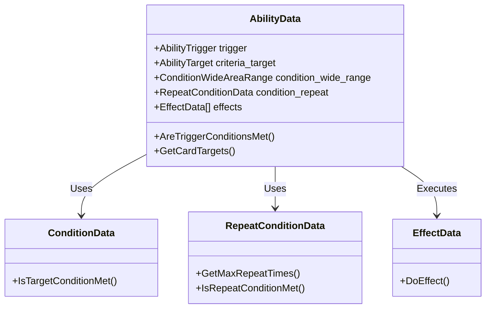

#### 덱 구조 리팩토링
- 편성된 학생에 따라 동아리 효과가 덱에 저장되고, 게임 시작 시 세팅되도록 변경했습니다.
- `DeckData`에 `clubs` 배열을 추가하여 동아리 시너지 정보를 포함시켰습니다.

### 신규 시스템 구현

#### 라이브 웹 서비스 구축 (https://your-domain.com)
- `UnityWebRequest`를 사용하여 NodeJS 서버와 통신하며, 카드 정보 및 이미지를 주고받는 라이브 웹 서비스를 구축했습니다.

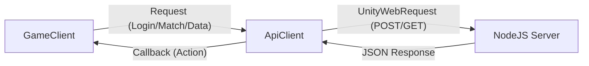

#### 마나 필터링 시스템 (Observer Pattern)
- 옵저버 디자인 패턴을 사용하여 마나 필터 UI를 구현했습니다.
- `ManaFilter`가 Subject 역할을 하며, 마나 버튼 클릭 시 `onManaClicked` 이벤트를 통해 `ManaFilterItem`들에게 알림을 보냅니다.

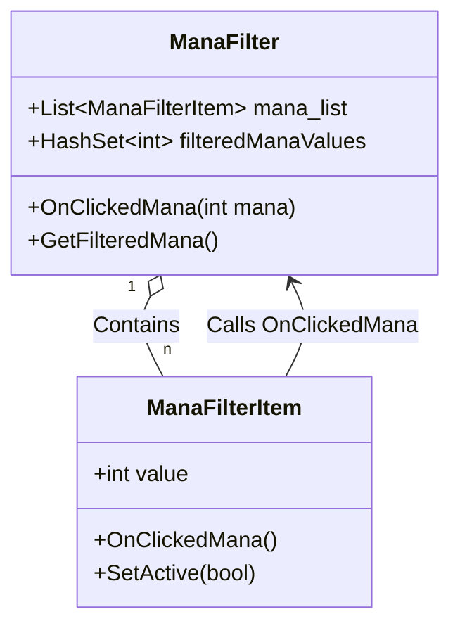


#### 덱 인포 UI
- 덱 정보를 분석하여 마나 커브 및 카드 타입별 비율을 확인할 수 있는 모듈화된 UI를 구현했습니다.

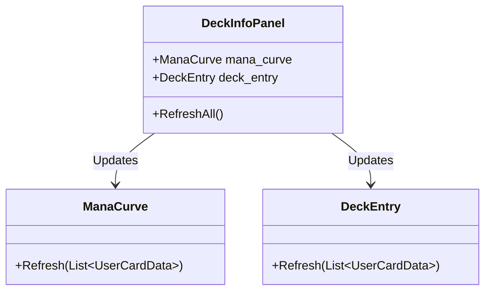

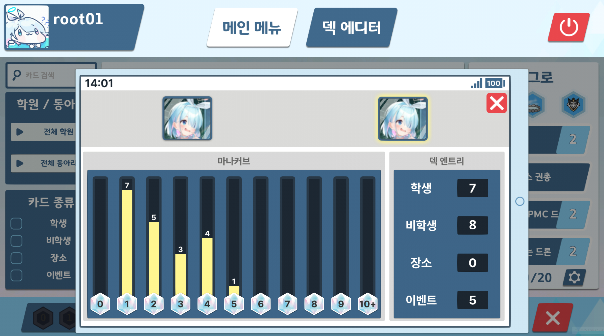

#### 초기 카드 교환 시스템 (Mulligan)
- 게임 시작 시 초기 패를 교환하는 멀리건 페이즈를 구현했습니다.

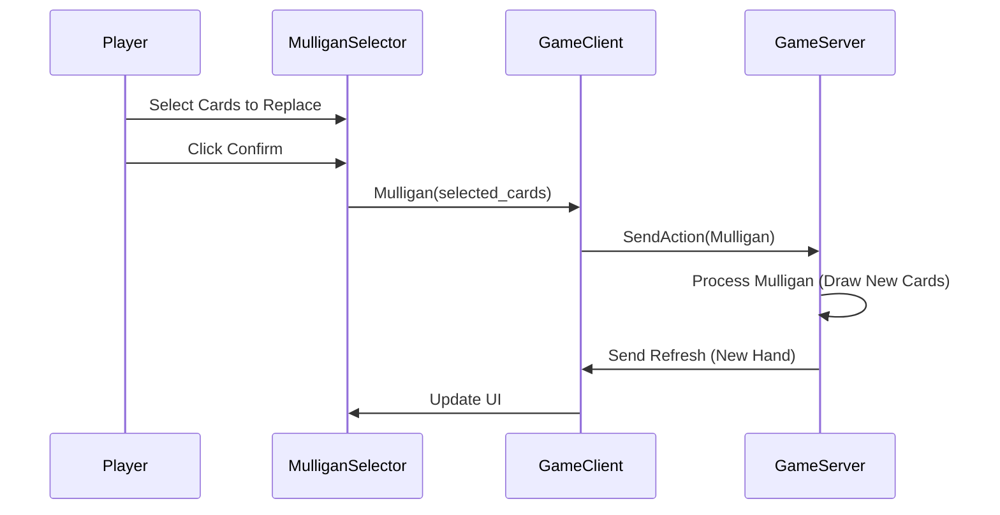

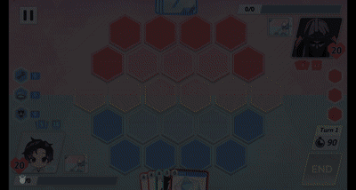

#### 튜토리얼 시스템 (Singleton)
- 싱글톤 패턴 기반의 `Tutorial` 시스템을 구축하여, 현재 단계에 맞게 플레이어의 입력을 제한하고 안내합니다.

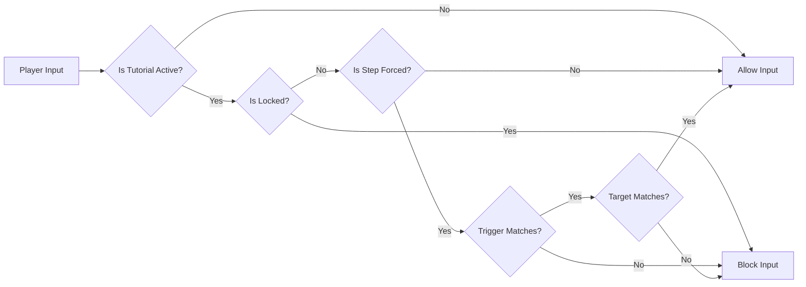

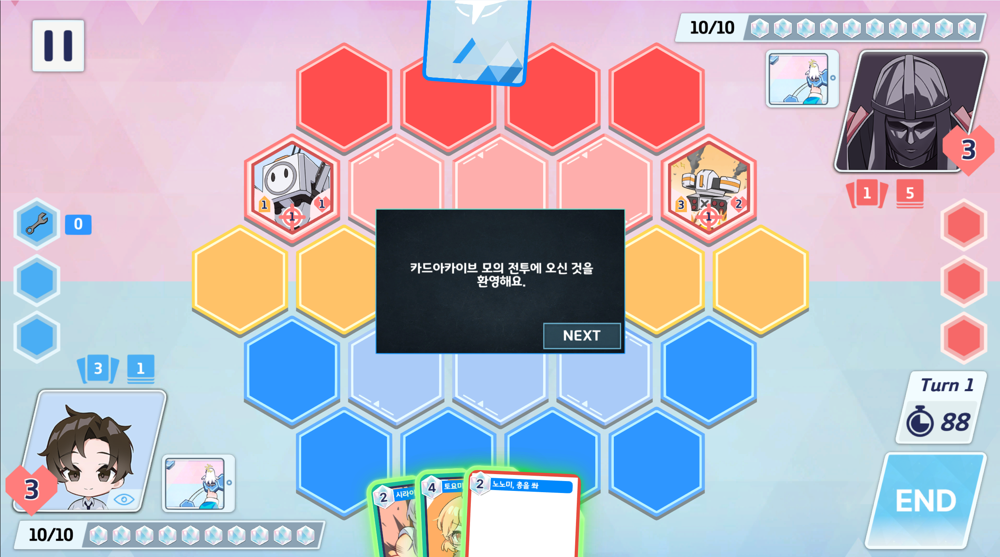

#### Slot 강조 FX 시스템 (Strategy Pattern)
- 전략 디자인 패턴을 사용하여 플레이어의 행동(드래그, 타겟팅, 대기 등)에 따라 달라지는 Slot 강조 FX 시스템을 구현했습니다.

```csharp
private BSlotIndicatorType SetCurrentType(Game game_data, BSlot current_slot)
{
    if (GameUI.IsUIOpened())
        return new BSlotIndicatorTypeNone();
        
    HandCard hcard = HandCard.GetDrag();

    if (game_data.selector == SelectorType.SelectTarget)
        return new BSlotIndicatorTypeSelector();

    if (hcard != null)
        return new BSlotIndicatorTypeDragCard();

    if (current_slot != null)
    {
        Card current_hovering_unit = game_data.GetSlotCard(current_slot.GetSlot());

        if (current_hovering_unit != null && current_hovering_unit.CardData.IsCitizen())
            return new BSlotIndicatorTypeHoverUnit();
    }

    return new BSlotIndicatorTypeNone();
}
```

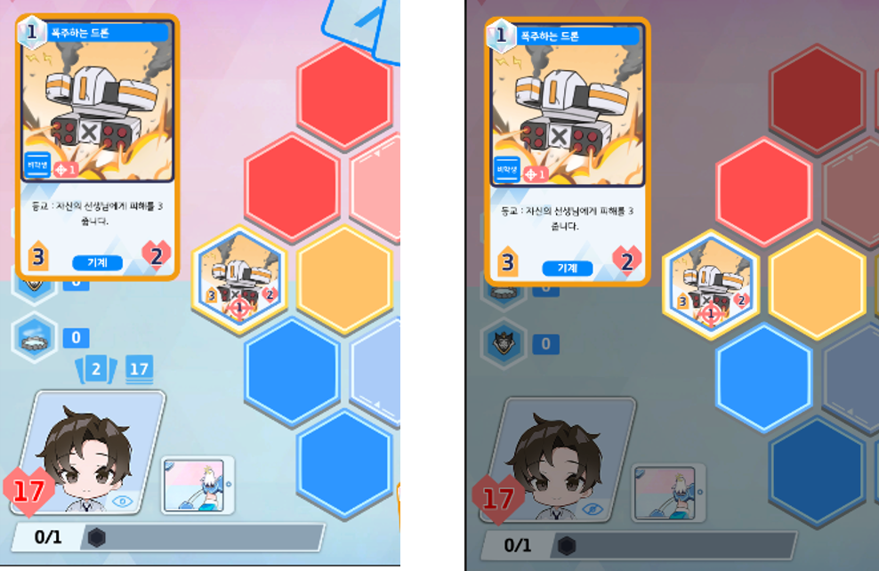
*Slot Indicator FX 적용 전 / 후 비교*

#### WeaponType 설계
- 사거리와 탐색 알고리즘을 별도로 지정할 수 있는 확장이 용이한 `WeaponType` 구조를 설계했습니다.
- `WeaponData`를 상속받아 다양한 공격 방식을 유연하게 추가할 수 있습니다.

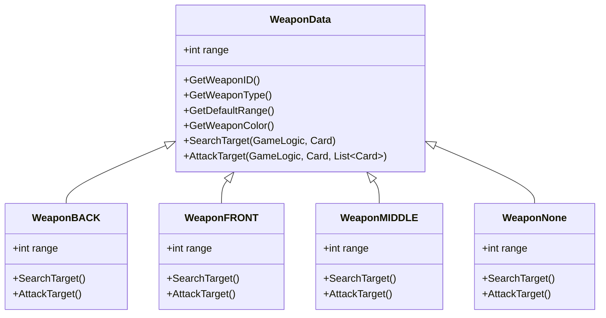

#### 공격 페이즈 및 자동 공격 시스템
- 커스텀 Queue 자료 구조를 활용하여 '하스스톤 전장'과 유사한 자동 공격 페이즈를 구현했습니다.
- `GameLogic`에서 공격 순서를 계산하고 Attack 큐에 넣어 순차적으로 공격을 수행합니다.

**1. Attack Phase 전체 흐름**
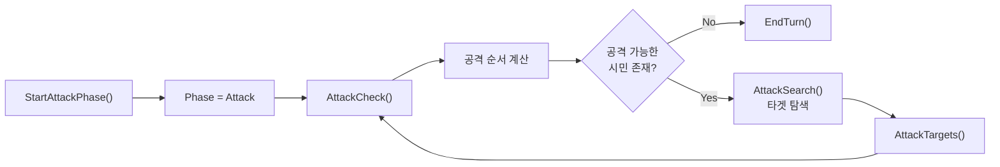

**2. AttackTargets 상세 흐름**
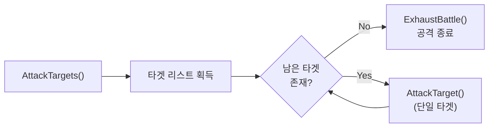

**3. AttackTarget 실행 단계**
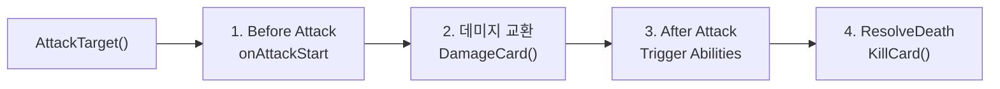

---

## 성과
- **2025년 10월**: 일러스타 페스 출품 (**124명** 플레이 후, 설문조사 진행)

    

- **2025년 4분기**: 배포 예정
